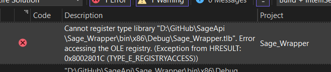
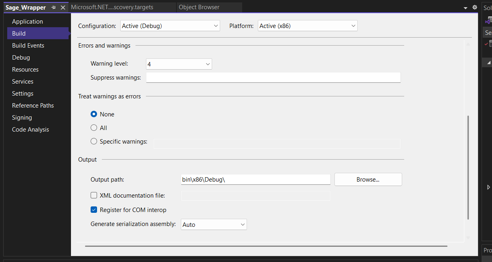

# Sage API 

## Intro 
This project is meant to provide a C# API to Sage 100c model bojects dll. 
That you can download [here](
https://fr-kb.sage.com/portal/app/portlets/results/viewsolution.jsp?solutionid=211010150079696).


# Build

## Prerequisites 

- Install the SageOM exe [DL link](https://fr-kb.sage.com/portal/app/portlets/results/viewsolution.jsp?solutionid=211010150079696). This is developped on V11.
- Have .netFramwork 4.8 (yeah ....) & .NetCore 8.0
- (Optional) Using Visual Studio to handle build issues, makes it simpler


## Compilation 

Please note the Sage DLL is running in 32 bits therefore we need to compile our project in 32 bits too. 
Please setup complie options for the wrapper project to Debug x86.


## Env variables
For security purposes, env variables are stored in the [windows secret manager](https://learn.microsoft.com/en-us/aspnet/core/security/app-secrets?view=aspnetcore-9.0&tabs=windows
). 
For mor info see [this tutorial]( https://dev.to/iamrule/how-to-c-add-configuration-to-your-net-8-web-api-application-4cjf)

For local dev they can be stored int the `appsetting.development.json`

# Use

TODO 

## Login 
The api requires a JWT token to use the routes.
This token can be obtained using the `login` route in exchange for an APIKey. 
For example using : 
```https://localhost:7283/api/Auth/login?apiKey=MyGreatAPIKey ```

Then using the token as bearer token to acces all other routes. 

# Routes

GET api/bijou : will return the list of `CT_intitule` for each client present in the BIJOU database. 


# Troubleshoot 

```Cannot register type library "D:\GitHub\SageApi\Sage_Wrapper\bin\x86\Debug\Sage_Wrapper.tlb". Error accessing the OLE registry. (Exception from HRESULT: 0x8002801C (TYPE_E_REGISTRYACCESS))```
- If you get the following error : 
Please deactivate interop compiling as follows : 

Right click on the Wrapper project, properties, build, unclick Register for COM Interop.


## Sources 

- This is largly based on the following article : 
https://textes.pistache.land/dece/creer-une-api-web-pour-interagir-avec-sage-100

